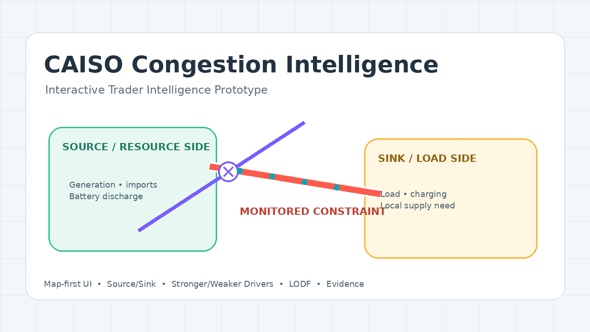

# CAISO Congestion Intelligence

**Interactive, map-first congestion intelligence for CAISO power markets.**

> Portfolio prototype · Last reviewed July 25, 2026



## Overview

CAISO Congestion Intelligence is an AI-product prototype designed to translate a transmission **constraint** and **constraint cause / contingency** into an intuitive geographic explanation of the congestion event.

The product is intentionally map-first: a trader or beginner should be able to understand the physical story visually, while analysts and engineers can open deeper layers for market and transmission detail.

### Core experience

```text
Constraint + Cause
        ↓
Interactive geographic grid view
        ↓
Monitored element + contingency
        ↓
Source / sink interpretation
        ↓
Stronger vs weaker binding drivers
        ↓
Outage sensitivity / LODF framework
        ↓
Evidence + confidence
```

## Current demonstration case

**Constraint**

`30590_USWP-JRW_230_30530_CAYETANO_230_BR_1 _1`

**Cause**

`PG1 COCOPP-LASPOS 230`

The prototype uses the Greater Bay / East Bay corridor as a demonstration of how an N-1 transmission contingency can be translated into an interactive market/trading explanation.

## Features

- Full-screen geographic congestion map
- Constraint and cause inputs
- Monitored-facility highlighting
- Contingency overlay
- Conceptual source and sink pockets
- Animated power-flow story
- Clickable grid elements
- Beginner / Analyst / Engineer explanation modes
- Trader Intelligence popup
- Stronger-vs-weaker binding driver matrix
- Battery charging/discharging interpretation
- LODF outage-sensitivity framework
- Impactful outage watchlist
- Evidence / confidence panel
- Modular map layers

## Trader Intelligence

The Trader Intelligence view answers the practical question:

> **What should I monitor to determine whether this congestion becomes stronger or weaker?**

Primary driver families include:

| Driver | Stronger binding | Weaker binding |
|---|---|---|
| Source-side generation | More reinforcing injection | Less injection / curtailment |
| Sink-side demand | Higher withdrawal | Lower load |
| Batteries | Sink charging / source discharge | Sink discharge / source charging |
| Local generation | Lower sink-side output | More local supply |
| Imports / exports | Reinforcing transfer | Counter-flow |
| Parallel outages | Positive LODF | Negative LODF / restored path |
| Facility rating | Derate | Higher available rating |
| Topology | Alternate path removed | Alternate path restored |

## LODF concept

A production-grade version should calculate current-case outage sensitivities rather than infer them visually.

A useful first-order relationship is:

```text
ΔF(monitored) ≈ LODF(monitored, outage) × F(outage, pre)
```

The portfolio prototype intentionally **does not fabricate numerical LODF values**.

## Data and evidence strategy

The product architecture prioritizes authoritative CAISO sources:

- CAISO OASIS
- CAISO Full Network Model / network-model change material
- CAISO Transmission Planning Process
- CAISO outage information
- CAISO renewable and energy-storage reports

See [SOURCES.md](SOURCES.md) for the source register and limitations.

## Current system context

As of **July 25, 2026**, the prototype is aligned to the CAISO **26M6_DB141** production-model context. This does not mean the displayed example is asserted to be binding on July 25; interval-specific binding claims require applicable OASIS market data.

## Technology

- HTML5
- CSS3
- JavaScript
- Leaflet
- OpenStreetMap / CARTO basemap

The current version is deliberately deployable as a static site. No server, package manager, or build step is required.

## Run locally

Clone/download the repository and open `index.html` in a modern browser with an internet connection.

For the most reliable local behavior, serve the folder using a local web server, for example:

```bash
python -m http.server 8000
```

Then open:

`http://localhost:8000`

## Deployment

The repository is designed for GitHub Pages. See [DEPLOYMENT.md](DEPLOYMENT.md).

## Architecture and roadmap

- [Architecture](docs/ARCHITECTURE.md)
- [Product roadmap](docs/ROADMAP.md)

## Production direction

The intended full product evolves from a curated portfolio prototype into a real congestion intelligence engine:

```text
User input
  ↓
Constraint parser / router
  ↓
Entity + topology resolver
  ↓
Current CAISO market / outage context
  ↓
PTDF / LODF / headroom analytics
  ↓
Source-sink + driver ranking
  ↓
Evidence-grounded AI explanation
  ↓
Interactive map
```

## Important limitations

- Current map coordinates are illustrative regional placements unless independently verified.
- Source/sink interpretation must ultimately be validated with applicable network/market sensitivities.
- Numerical LODF/PTDF is not calculated by this static prototype.
- The current application is a demonstration case, not yet an arbitrary-constraint production solver.
- It is not a substitute for CAISO official market or reliability systems.

## Repository policy

This public repository is intended to showcase the front-end product experience and high-level architecture. Future proprietary backend methods, premium data access, scoring logic, and model prompts should be maintained separately in a private repository.

## Disclaimer

Independent portfolio/research prototype. Not affiliated with or endorsed by CAISO. Market and transmission information should be verified against authoritative CAISO data before operational or financial decisions.
